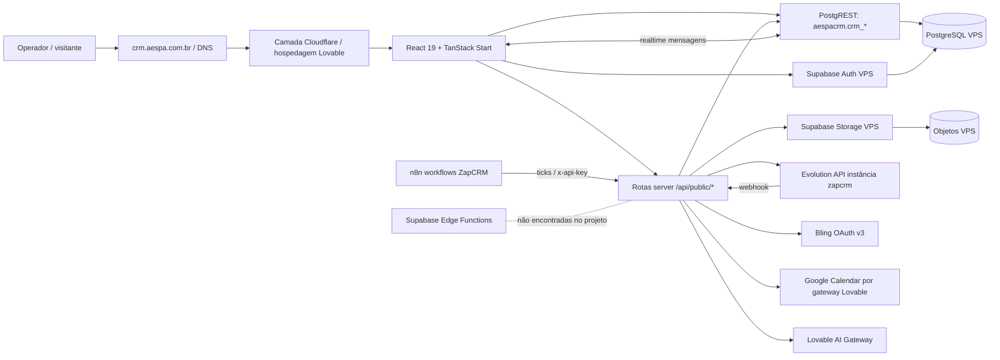

# Arquitetura e fluxo de dados

Legenda: [C] código/configuração confirmados; [I] inferência; [NV] não verificado; [E] inspeção externa necessária. Consulte o índice para o escopo.

- **Frontend [C]:** `src/routes/__root.tsx` monta AuthProvider/Outlet; `_app.tsx` monta AppShell e páginas; Tailwind v4/shadcn; rotas via arquivos; `src/lib/db.ts` usa cliente Supabase direto do navegador com RLS. Scripts e versões: [inventário](inventario-tecnico.md).
- **Backend [C]:** TanStack Start com handlers HTTP em `src/routes/api.public.*`; funções RPC TanStack em `src/lib/*.functions.ts` e `src/integrations/supabase/client.ts`; auxiliares `*.server.ts` e `src/server`. `getSupabaseAdmin()` utiliza service role e ignora RLS, portanto filtros de proprietário são obrigatórios. [NV] Não foi confirmado se o tráfego real chega exatamente à revisão auditada.
- **Banco/Auth [C]:** Supabase auto-hospedado com schema `aespacrm`; conta/sessão no Auth; dados em `crm_*`; separação por `user_id` e allowlist. Perfil `profiles` é consultado via cliente no schema `aespacrm`; existência e grants reais a verificar. Os scripts usam referências a `auth.users` — não copiar o schema compartilhado ao recriar este CRM. [E] Topologia, versão e região/ID do banco não disponíveis.
- **Storage [C]:** bucket privado `crm-status-media` (20 MB/arquivo, URLs assinadas); bucket público de cache `crm-avatars` (2 MB). Criação sob demanda no servidor; mídia de mensagem também pode estar no banco em base64 ou recuperada da Evolution. [NV] Objetos e policies em produção não inventariados.
- **Realtime [C]:** canais Supabase de mensagens em `_app.inbox.tsx` e `use-global-message-ping.ts`; comunicação HTTP continua necessária para enviar mensagem. [E] Publicação `supabase_realtime` e parâmetros da VPS não inspecionados.
- **Edge Functions [C]:** não há diretório de funções Supabase neste checkout; servidor HTTP do projeto é TanStack Start. Não afirmar que funções externas na VPS não existem; verificar em Portainer/SQL. O runtime de destino declara `nodejs_compat` em `wrangler.jsonc`.
- **WhatsApp/n8n [C]:** Evolution `zapcrm`, webhook autenticado por `apikey`, n8n chama ticks com `x-api-key`; o fluxo de Status persiste checkpoints e nunca deve reenviar um lote incerto. [E] Estado dos workflows no n8n e versão real da Evolution exigem inspeção no serviço.
- **Bling/Calendar/IA [C]:** Bling v3 com OAuth e tokens por usuário em `crm_app_secrets`; Calendar pelo conector Google via gateway, listado como ligado ao projeto; IA por proxy com `LOVABLE_API_KEY`. [NV] Permissões/quotas e funcionamento atual não testados.
- **E-mail [I]:** recuperação de senha chama Supabase Auth; SMTP/configuração real não visível. Não há comprovação de provedor Resend/SMTP próprio no código auditado. [E] Confirmar Auth SMTP e URLs permitidas no painel da VPS.
- **Domínio/Cloudflare [C/E]:** URL de produção e referência explícita ao domínio no código; `wrangler.jsonc` aponta runtime Worker. DNS, WAF, TLS, regras proxy, logs e titularidade requerem inspeção externa. Não pressupor que Cloudflare da VPS e hospedagem do app compartilhem a mesma conta.

**Caminhos críticos:** Inbox → `authFetch` (Bearer) → `send-and-log` → Evolution → `crm_messages`; mensagens recebidas → webhook Evolution → contatos/mensagens, pausas de sequências e possíveis ações de agenda; Status → biblioteca/storage → tick chamado manualmente ou por n8n → snapshot de contatos Evolution → lotes 20 → checkpoint `crm_status_runs`; falha ambígua → `uncertain`, rodízio pausado. [C: arquivos citados acima e `status-tick.ts`]
