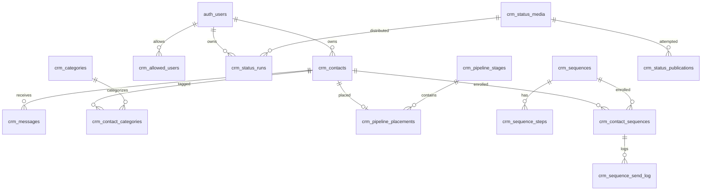

# Banco de dados, migrações e reconstrução

**[C]** O aplicativo usa Supabase auto-hospedado compartilhado, dados do CRM exclusivamente em `aespacrm.crm_*`; Auth usa `auth.users` e Storage usa seus próprios metadados/objetos. Os 43 SQLs locais são evidência de intenção, **não** dump do estado real. **[NV]** ID/região Supabase, versão PostgreSQL, extensões instaladas, linhas/tabelas/views/RPCs/grants/policies reais, sequências e backup/PITR não foram consultados. Não rodar qualquer SQL de escrita sem aprovação explícita; mesmo scripts ditos idempotentes contêm triggers/backfills/alterações.

## Estrutura declarada
Tabela de colunas iniciais e *todos* os arquivos locais: [catálogo estático](catalogo-estatico.md). Para colunas adicionais, tipos, defaults, chaves, constraints, índices e FKs **efetivos**, gerar snapshot somente leitura do catálogo; não usar o catálogo inicial como contrato de produção. Classes de dados sensíveis: telefones, mensagens e `raw` do webhook, perfis, nomes, propostas e valores, JIDs, tokens no `crm_app_secrets`, lista de destinatários `crm_status_runs.recipients`, URLs assinadas/paths. Nunca exportar dados pessoais para documentação.

| Conjunto de tabelas (26 com `CREATE TABLE` local) | Função / relações principais | Acesso previsto no SQL |
|---|---|---|
| `crm_allowed_users`, `crm_app_secrets`, `crm_user_settings` | allowlist, cofre por usuário, preferências | allowlist: SELECT próprio; secrets: service_role apenas; settings: verificar script e política efetiva. |
| `crm_categories`, `crm_contacts`, `crm_contact_categories`, `crm_ignored_phones` | contatos/tags M:N/blacklist; FKs contato/categoria | Auth do proprietário (base + M:N), triggers sincronizam tags/blacklist; policies efetivas requerem verificação. |
| `crm_pipeline_stages`, `crm_pipeline_placements` | etapas e contato na etapa | Operações CRUD do próprio `user_id` via RLS base. |
| `crm_messages`, `crm_webhook_events`, `crm_instance_state` | mensagens, entrada Evolution, estado da instância | Mensagens por dono; logs/estado com policies de leitura próprias; escritas server service role no webhook. |
| `crm_bulk_sends`, `crm_sequences`, `crm_sequence_steps`, `crm_contact_sequences`, `crm_sequence_send_log`, `crm_message_templates` | campanhas, passos, inscrições/logs, templates | Base por dono, novos objetos com políticas próprias; ticks n8n usam admin + filtro de usuário. |
| `crm_appointment_reminders`, `crm_bling_auto_log` | lembretes/presença, histórico de propostas enviadas | Grants e RLS próprios; verificar tabela efetiva. |
| `crm_capture_widgets`, `crm_optout_shortlinks` | formulário público, shortlinks de descadastro | Widgets com RLS por dono; shortlinks com policy SELECT para anon/autenticado **se grant efetivo permitir**. |
| `crm_status_settings`, `crm_status_media`, `crm_status_publications`, `crm_status_runs` | biblioteca, rodízio, tentativas, checkpoints | settings/media CRUD do dono com allowlist; publications/runs somente SELECT do dono com allowlist; escritas via service_role. |

**Inconsistências e riscos [C/NV]:** `crm_ai_enrichment_logs` é usada em `src/lib/ai-enrichment-logs.functions.ts`, mas não existe `CREATE TABLE` em nenhum SQL local — estado real [NV]. `SUPABASE_ROLLBACK_BOT_PROMPTS.sql` faz DROP de tabela sem migração forward local; não executá-lo como etapa de instalação. `SUPABASE_MIGRATION_OPTOUT_SHORTLINKS.sql` depende de `search_path` para criar no schema certo. `SUPABASE_MIGRATION_GROUPS.sql` remove e recria índice único de telefone; não reexecutar em ambiente real sem revisar colisões. `crm-status-media` bucket é criado pela aplicação, não por migration. Políticas de allowlist adicionadas no script `ALLOWED_USERS` às 10 tabelas base; **não supor** sua presença em tabelas criadas depois sem inspecionar cada script e catálogo real. `SUPABASE_MIGRATION.sql` contém grants globais ao schema autenticado; grants do banco atual exigem inspeção. `MIGRATION_PLAN.md` é histórico de fase antiga e não descreve a aplicação atual.

## Relacionamentos principais (simplificados)

**[C]** FK exata e nulabilidade: consultar SQLs; diagrama é simplificado. Referências a `auth.users` não autorizam migrar/excluir Auth compartilhado.

## Ordem de instalação **parcial**, não garantida
1. **[C]** `SUPABASE_MIGRATION.sql` cria schema e base. `SUPABASE_MIGRATION_ALLOWED_USERS.sql` requer base + conta Auth pré-existente; seu INSERT de exemplo é específico do ambiente original — **substituir por processo administrativo, nunca copiar identificadores de usuários**. `PHASE1_5`, `MULTI_CATEGORIES`, `PHASE3`, `PHASE4`, `PHASE5_AI`, `PHASE6_AI_TERMS`, `PHASE7_SEQUENCES_UX` são incrementais; Phase7 exige `crm_user_settings` da Phase6.
2. **[C]** `STATUS_ROTATION` antes de `STATUS_BATCHES`; `BLACKLIST` antes de `BLACKLIST_9TH_DIGIT_FIX`; `APPOINTMENT_REMINDERS` antes de `ATTENDANCE`; `MULTI_CATEGORIES` antes de `TAG_SOURCE`; `PHASE4` antes de `TEMPLATE_MEDIA`; `APP_SECRETS` antes de OAuth Bling; `BLING_AUTO` antes do tick; base antes dos demais.
3. **[NV]** Ordem global de todos os 43 scripts, presença de patches manuais no banco e segurança de reexecução não comprovadas. Não aplicar em ordem alfabética, nem executar `DROP_LEGACY_TABLES`, `ROLLBACK_BOT_PROMPTS`, `MERGE_DUPLICATE_CONTACTS`, `DATA_FIX_*`, `BACKFILL_*`, `CLEANUP_*`, `RENAME_*` como bootstrap sem plano aprovado e conferência do banco de destino. Depois de alterações aprovadas, recarregar cache PostgREST; a VPS compartilha o serviço com outros projetos.

## Inventário somente leitura a solicitar ao DBA [E]
Use consultas *limitadas ao schema `aespacrm`* em ambiente controlado, sem linhas de clientes:
```sql
select table_name, table_type from information_schema.tables where table_schema='aespacrm' order by 1;
select table_name,column_name,data_type,is_nullable,column_default from information_schema.columns where table_schema='aespacrm' order by 1,ordinal_position;
select tablename,policyname,roles,cmd,qual,with_check from pg_policies where schemaname='aespacrm' order by 1,2;
select table_name,grantee,privilege_type from information_schema.role_table_grants where table_schema='aespacrm' order by 1,2,3;
select extname,extversion from pg_extension order by extname;
```
Também levantar `pg_indexes`, `pg_constraint`, `pg_trigger`, `pg_proc`/`pg_namespace`, `pg_views`, `pg_sequences` filtrados por schema; listar migrations aplicadas e buckets por ferramenta de administração somente leitura, com saídas sanitizadas.

## Backup e restauração (procedimento, **não executado**) [E]
1. Confirmar DBA, janela, versão do PostgreSQL e destino; congelar/pausar somente jobs `[ZapCRM]` e publicações sob plano aprovado. Registrar contagens/checksums sem expor dados pessoais. Fazer backup do schema `aespacrm` com `pg_dump --format=custom --schema=aespacrm --file=<arquivo-seguro> <conexao-administrativa>` por operador na VPS; segredos via canal seguro, nunca em histórico/docs. Separadamente preservar as identidades Auth necessárias (não restaurar `auth.users` compartilhado cegamente), buckets/objetos `crm-status-media` e `crm-avatars`, secrets por usuário, configurações OAuth e workflows; dump de schema sozinho **não reconstrói** o sistema.
2. Ensaio em instância isolada com *novo* Supabase: preparar roles/extension/Auth/Storage, restaurar dump por `pg_restore --dbname=<instancia-de-ensaio> --schema=aespacrm <arquivo-seguro>` sob aprovação; remapear contas e FKs sob orientação do DBA. Restaurar objetos com paths preservados, configurar secrets por serviço, revisar grants/RLS/anon antes de conectar browser; rebuild com lockfile selecionado e variáveis públicas corretas. Nunca apontar ambiente de teste para Evolution de produção.
3. Comparar inventários, contagem de objetos e checksums, políticas, índices, login, reads, disponibilidade e URLs assinadas; simular cron sem envio real. Fazer troca DNS/serviços somente depois de ensaio e rollback aprovados. Validar restauração periódica e armazenar backups criptografados fora da VPS compartilhada. Não afirmar backup existente: **[NV]**.
